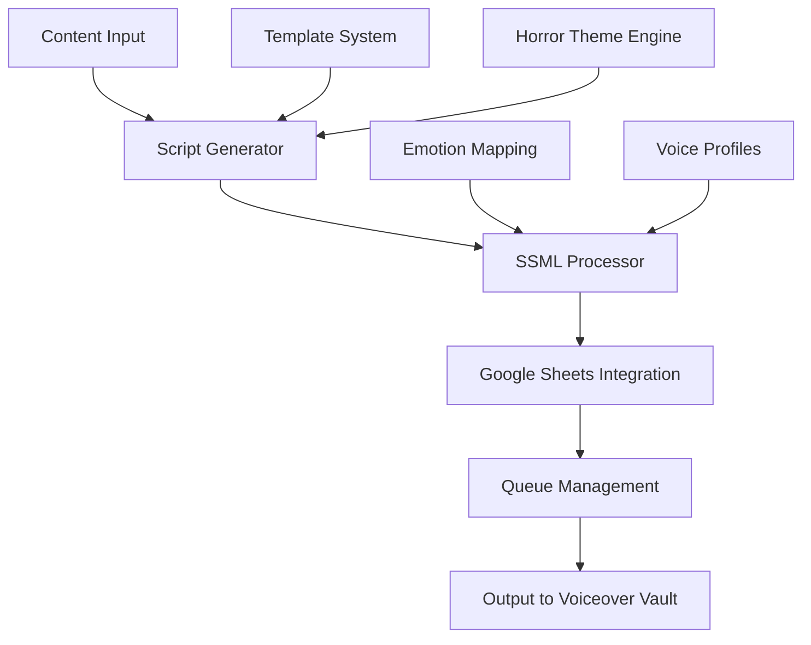

# 🧠 Stage 1: Script Engine

> **Content Generation and SSML Processing Pipeline**

The Script Engine is the foundational component of the Oracle Horror Production System, responsible for generating intelligent content and processing Speech Synthesis Markup Language (SSML) for advanced voice synthesis.

## 🎯 Purpose

The Script Engine serves as the content generation hub, transforming raw ideas and inputs into structured, horror-themed content ready for voice synthesis and video production.

## 🏗️ Architecture



## 🔧 Components

### 📝 SSML Generator (`02_SSML_Generator.ipynb`)
**Primary Function**: Converts text content into structured SSML markup

**Features**:
- Emotion-based voice modulation
- Dynamic pacing and emphasis
- Horror-specific audio effects integration
- Multi-voice character support

**Input**: Raw text content, voice configuration
**Output**: Structured SSML files ready for synthesis

### 📊 Google Sheets Integration
**Primary Function**: Content management and workflow coordination

**Features**:
- Real-time content synchronization
- Batch processing queue management
- Status tracking and reporting
- Collaborative editing support

**APIs Used**: Google Sheets API v4, Google Drive API

## 🚀 Usage

### Basic Content Generation

```powershell
# Generate horror-themed content
.\MasterControl.ps1 -Operation execute -TemplateProfile "horror_alerts"

# Process specific voice count
.\MasterControl.ps1 -Operation execute -VoiceFiles 15 -TemplateProfile "tech_alerts"
```

### Advanced SSML Processing

```python
# Direct notebook execution
jupyter notebook 02_SSML_Generator.ipynb

# Batch processing via Python
python scripts/process_ssml_batch.py --input content.txt --output ssml/
```

## 📋 Configuration

### Template Profiles

| Profile | Description | Use Case |
|---------|-------------|----------|
| `horror_alerts` | Horror-themed emergency alerts | Suspense content |
| `tech_alerts` | Technical documentation style | Educational content |
| `arg_narrative` | ARG storyline development | Interactive experiences |

### Voice Configuration

```json
{
  "voiceProfiles": {
    "primary": {
      "language": "en-US",
      "voice": "neural-dark",
      "speed": "0.9",
      "pitch": "-2st"
    },
    "secondary": {
      "language": "en-US", 
      "voice": "neural-whisper",
      "speed": "0.7",
      "pitch": "-5st"
    }
  }
}
```

## 📁 File Structure

```
1_Script_Engine/
├── 02_SSML_Generator.ipynb     # Main SSML processing notebook
├── Google_Sheets_Integration/  # Google API integration scripts
│   ├── auth_config.json       # Authentication configuration
│   ├── sheets_connector.py    # Python sheets integration
│   └── data_sync.ps1         # PowerShell sync utilities
├── templates/                 # Content generation templates
│   ├── horror_alerts.json    # Horror-themed templates
│   ├── tech_alerts.json     # Technical documentation templates
│   └── arg_narrative.json   # ARG storyline templates
├── output/                   # Generated content staging
│   ├── raw_content/         # Initial content generation
│   ├── processed_ssml/      # Processed SSML files
│   └── metadata/           # Content metadata and tracking
└── placeholder.txt          # Development placeholder
```

## 🔄 Workflow

1. **Content Input**: Raw content or theme specification
2. **Template Selection**: Choose appropriate content template
3. **Content Generation**: AI-powered content creation
4. **SSML Processing**: Convert to speech markup language
5. **Google Sheets Sync**: Update central content database
6. **Queue Management**: Prepare for voice synthesis
7. **Output Staging**: Ready files for Stage 2 (Voiceover Vault)

## 🧪 Testing

### Unit Tests

```powershell
# Test SSML generation
.\test_ssml_generation.ps1

# Validate Google Sheets connectivity
.\test_sheets_integration.ps1
```

### Integration Tests

```powershell
# End-to-end pipeline test
.\MasterControl.ps1 -Operation test -Verbose
```

## 🔍 Monitoring

### Status Indicators

- **✅ Online**: SSML generator responsive
- **📊 Synced**: Google Sheets integration active
- **🗂️ Loaded**: Content templates available
- **🧠 Operational**: AI content generation active

### Health Checks

```powershell
# Component status
.\MasterControl.ps1 -Operation status | Select-String "Script Engine"

# Detailed diagnostics
.\diagnose_script_engine.ps1 -Verbose
```

## 🛠️ Troubleshooting

### Common Issues

**🚨 Google Sheets Authentication Failed**
```powershell
# Solution: Regenerate authentication token
Remove-Item "token_sheets_rw.pickle" -Force
python scripts/reauth_google.py
```

**🚨 SSML Generation Errors**
```powershell
# Solution: Clear cache and restart
Remove-Item "output/processed_ssml/*" -Force
jupyter notebook 02_SSML_Generator.ipynb
```

**🚨 Template Loading Failed**
```powershell
# Solution: Validate template syntax
python scripts/validate_templates.py templates/
```

## 📈 Performance Metrics

- **Content Generation Speed**: ~500 words/minute
- **SSML Processing Rate**: ~15 files/minute
- **Google Sheets Sync**: Real-time updates
- **Error Rate**: <2% in optimal conditions

## 🔗 Integration Points

- **⬇️ Input Sources**: Manual content, AI generators, template systems
- **⬆️ Output Targets**: Stage 2 (Voiceover Vault), Google Sheets database
- **🔄 Dependencies**: Google API credentials, Jupyter environment, PowerShell 5.1+

## 📚 Additional Resources

- [SSML Specification](https://www.w3.org/TR/speech-synthesis11/)
- [Google Sheets API Documentation](https://developers.google.com/sheets/api)
- [Jupyter Notebook Best Practices](https://jupyter-notebook.readthedocs.io/)

---

**Stage Status**: ✅ **Operational**  
**Last Updated**: August 2024  
**Maintainer**: [GCode3069](https://github.com/GCode3069)