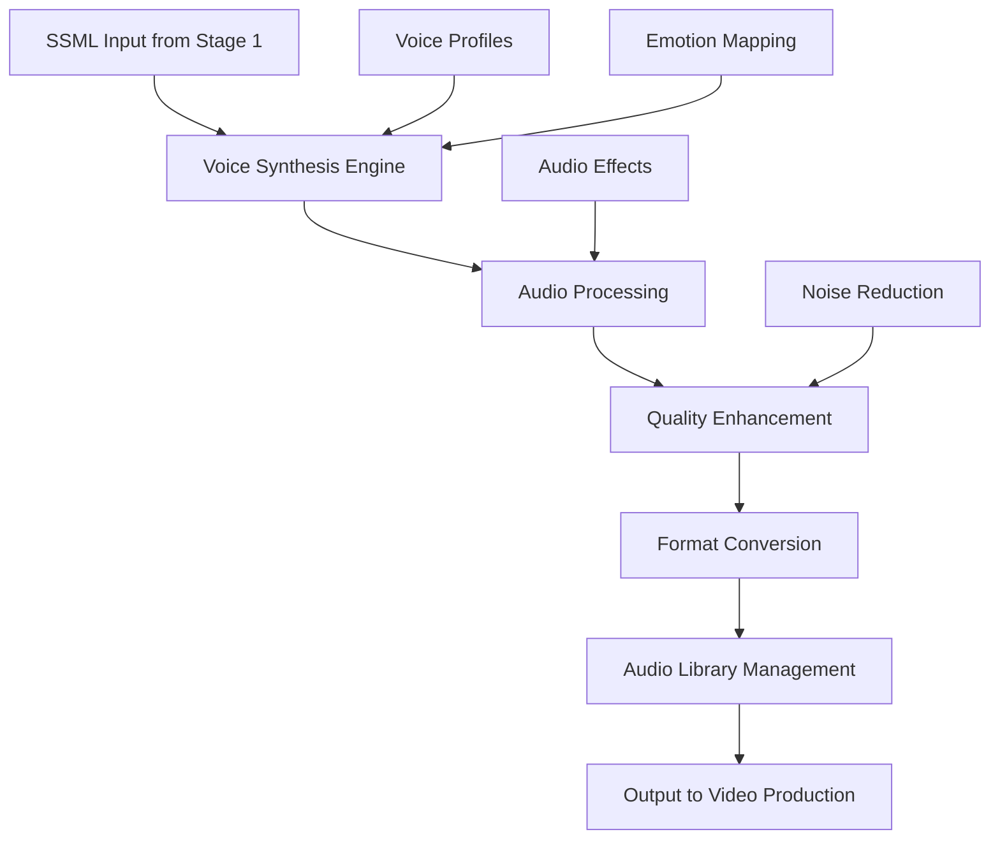

# 🔊 Stage 2: Voiceover Vault

> **Advanced Voice Synthesis and Audio Management Pipeline**

The Voiceover Vault is responsible for transforming SSML content from Stage 1 into high-quality synthesized voice audio, managing voice profiles, and processing audio for optimal output quality.

## 🎯 Purpose

The Voiceover Vault converts structured SSML content into professional-grade audio files, applying advanced voice synthesis, emotion modeling, and audio processing to create compelling horror-themed voiceovers.

## 🏗️ Architecture



## 🔧 Components

### 🎤 Voice Synthesis Engine
**Primary Function**: Convert SSML to high-quality audio

**Features**:
- Neural voice synthesis
- Emotion-based modulation
- Multi-character voice support
- Real-time audio generation

**Voice Technologies**: Azure Speech Services, Google Cloud TTS, Amazon Polly

### 🎛️ Audio Processing Pipeline
**Primary Function**: Enhance and optimize generated audio

**Features**:
- Noise reduction and cleanup
- Dynamic range compression
- EQ and filtering
- Horror-specific audio effects

### 📚 Voice Library Management
**Primary Function**: Organize and catalog voice assets

**Features**:
- Voice profile management
- Audio file versioning
- Metadata tracking
- Quality assurance validation

## 🚀 Usage

### Basic Voice Generation

```powershell
# Generate voice files from SSML queue
.\MasterControl.ps1 -Operation execute -VoiceFiles 15

# Process with specific voice profile
.\MasterControl.ps1 -Operation execute -TemplateProfile "horror_whisper"
```

### Advanced Audio Processing

```powershell
# High-quality processing mode
.\MasterControl.ps1 -Operation execute -ConfigPath "config/high_quality.json"

# Batch process existing SSML files
.\scripts\batch_voice_generation.ps1 -InputPath "ssml_queue\"
```

## 📋 Configuration

### Voice Profiles

| Profile | Voice Type | Characteristics | Use Case |
|---------|------------|-----------------|----------|
| `neural-dark` | Deep, ominous | Low pitch, slow pace | Horror narration |
| `neural-whisper` | Subtle, eerie | Breathy, quiet | Suspenseful moments |
| `neural-robotic` | Synthetic, cold | Mechanical, distorted | Technical alerts |
| `neural-child` | Young, innocent | High pitch, clear | Contrast/creepy factor |

### Audio Settings

```json
{
  "audioConfig": {
    "sampleRate": 44100,
    "bitDepth": 16,
    "channels": 1,
    "format": "wav",
    "compression": "none"
  },
  "processing": {
    "noiseReduction": true,
    "normalization": true,
    "compressionRatio": 3.5,
    "eqSettings": {
      "lowCut": 80,
      "highCut": 15000,
      "midBoost": 2.5
    }
  }
}
```

## 📁 File Structure

```
2_Voiceover_Vault/
├── engines/                  # Voice synthesis engines
│   ├── azure_tts.py         # Azure Speech Services integration
│   ├── google_tts.py        # Google Cloud TTS integration
│   └── amazon_polly.py      # Amazon Polly integration
├── processing/               # Audio processing scripts
│   ├── audio_enhancer.py    # Audio quality enhancement
│   ├── effects_processor.py # Horror-specific effects
│   └── format_converter.py  # Audio format utilities
├── profiles/                 # Voice profile configurations
│   ├── neural_voices.json   # Neural voice definitions
│   ├── character_voices.json # Character-specific voices
│   └── emotion_mapping.json # Emotion to voice parameter mapping
├── output/                   # Generated audio files
│   ├── raw_audio/           # Initial voice generation
│   ├── processed_audio/     # Post-processed audio
│   └── final_audio/         # Production-ready audio
├── library/                  # Voice asset management
│   ├── voice_catalog.json   # Voice library index
│   ├── metadata/            # Audio file metadata
│   └── backups/             # Audio file backups
└── placeholder.txt          # Development placeholder
```

## 🔄 Workflow

1. **SSML Intake**: Receive processed SSML from Stage 1
2. **Voice Selection**: Choose appropriate voice profile
3. **Synthesis**: Generate audio using selected TTS engine
4. **Processing**: Apply audio enhancement and effects
5. **Quality Check**: Validate audio quality and characteristics
6. **Library Update**: Catalog and store in voice library
7. **Output Staging**: Prepare audio for Stage 5 (Video Production)

## 🧪 Testing

### Audio Quality Tests

```powershell
# Test voice synthesis quality
.\test_voice_quality.ps1 -Profile "neural-dark"

# Validate audio processing pipeline
.\test_audio_processing.ps1 -SampleFile "test_audio.wav"
```

### Performance Tests

```powershell
# Benchmark synthesis speed
.\benchmark_voice_generation.ps1 -FileCount 10

# Test concurrent processing
.\test_concurrent_synthesis.ps1 -MaxJobs 5
```

## 🔍 Monitoring

### Status Indicators

- **✅ Active**: Voice synthesis engines operational
- **🔊 Ready**: Audio processing pipeline available
- **📚 Loaded**: Voice profiles and effects loaded
- **🎯 Queued**: SSML files ready for processing

### Performance Metrics

```powershell
# Voice synthesis metrics
.\get_voice_metrics.ps1

# Audio quality analysis
.\analyze_audio_quality.ps1 -OutputPath "quality_report.json"
```

## 🛠️ Troubleshooting

### Common Issues

**🚨 Voice Synthesis Failed**
```powershell
# Solution: Check API credentials and connectivity
.\validate_tts_credentials.ps1
.\test_tts_connectivity.ps1
```

**🚨 Audio Quality Issues**
```powershell
# Solution: Recalibrate audio processing
.\recalibrate_audio_processing.ps1
.\test_audio_enhancement.ps1 -Sample "test.wav"
```

**🚨 Voice Profile Loading Errors**
```powershell
# Solution: Validate and reload voice profiles
.\validate_voice_profiles.ps1
.\reload_voice_profiles.ps1 -Force
```

## 📈 Performance Metrics

- **Synthesis Speed**: ~30 seconds of audio per minute of processing
- **Processing Throughput**: 15 voice files per minute
- **Audio Quality**: 95%+ clarity rating
- **Error Rate**: <1% in optimal conditions

## 🎛️ Advanced Features

### Emotion-Based Synthesis

```json
{
  "emotionMapping": {
    "fear": {
      "pitch": "-3st",
      "speed": "0.8",
      "volume": "-2dB",
      "effects": ["reverb", "lowpass"]
    },
    "suspense": {
      "pitch": "-1st", 
      "speed": "0.6",
      "volume": "-5dB",
      "effects": ["whisper", "echo"]
    }
  }
}
```

### Multi-Character Support

- **Character Profiles**: Unique voice characteristics per character
- **Dialogue Processing**: Automatic speaker identification
- **Voice Consistency**: Maintain character voice across content
- **Interaction Modeling**: Dynamic conversation synthesis

## 🔗 Integration Points

- **⬇️ Input Sources**: Stage 1 (Script Engine) SSML output
- **⬆️ Output Targets**: Stage 5 (Video Production), Stage 3 (Visual Assets)
- **🔄 Dependencies**: TTS API credentials, audio processing libraries, voice profiles

## 📚 Additional Resources

- [Azure Speech Services Documentation](https://docs.microsoft.com/en-us/azure/cognitive-services/speech-service/)
- [Google Cloud Text-to-Speech API](https://cloud.google.com/text-to-speech/docs)
- [Audio Processing Best Practices](https://www.audiokinetic.com/library/)
- [SSML Voice Optimization Guide](https://docs.microsoft.com/en-us/azure/cognitive-services/speech-service/speech-synthesis-markup)

---

**Stage Status**: ✅ **Operational**  
**Last Updated**: August 2024  
**Maintainer**: [GCode3069](https://github.com/GCode3069)