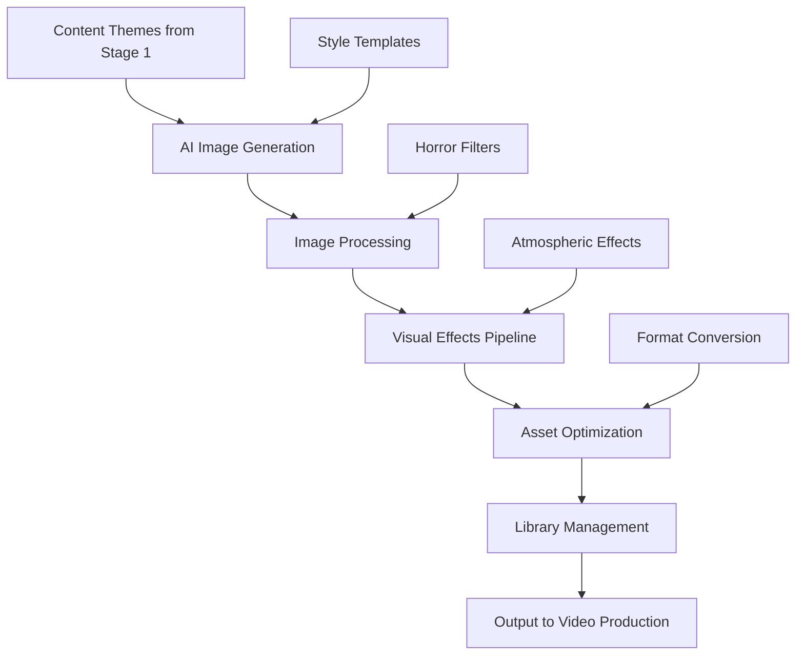

# 🎨 Stage 3: Visual Assets

> **Image Generation and Graphic Processing Pipeline**

The Visual Assets stage handles the creation, processing, and management of all visual content for the Oracle Horror Production System, from AI-generated imagery to post-processed graphics optimized for video production.

## 🎯 Purpose

Visual Assets transforms concepts and themes into compelling visual content, creating atmospheric imagery, graphics, and visual effects that enhance the horror experience and support the overall narrative structure.

## 🏗️ Architecture



## 🔧 Components

### 🤖 AI Image Generation Engine
**Primary Function**: Generate horror-themed imagery from text descriptions

**Features**:
- DALL-E 3 / Midjourney integration
- Horror-specific style prompting
- Consistent visual theme maintenance
- Batch generation capabilities

**Input**: Text descriptions, style parameters
**Output**: High-resolution base images

### 🖼️ Image Processing Pipeline
**Primary Function**: Enhance and modify generated images

**Features**:
- Atmospheric enhancement
- Color grading and mood adjustment
- Noise and texture overlay
- Horror-specific filter effects

### 📚 Asset Library Management
**Primary Function**: Organize and catalog visual assets

**Features**:
- Hierarchical asset organization
- Version control and history
- Metadata tagging and search
- Quality assurance validation

## 🚀 Usage

### Basic Image Generation

```powershell
# Generate images based on current content theme
.\MasterControl.ps1 -Operation execute -TemplateProfile "horror_visuals"

# Process specific number of visual assets
.\scripts\generate_visuals.ps1 -Count 20 -Style "dark_cyberpunk"
```

### Advanced Processing

```powershell
# High-quality visual processing
.\scripts\process_visuals.ps1 -Quality "cinematic" -Effects "atmospheric"

# Batch process existing images
.\scripts\batch_enhance_images.ps1 -InputFolder "raw_images\"
```

## 📋 Configuration

### Visual Styles

| Style | Description | Characteristics | Use Case |
|-------|-------------|-----------------|----------|
| `dark_cyberpunk` | Futuristic horror | Neon, tech, shadows | Tech horror content |
| `gothic_horror` | Classic horror | Dark, ornate, Victorian | Traditional scares |
| `cosmic_dread` | Lovecraftian themes | Space, tentacles, void | Existential horror |
| `industrial_decay` | Post-apocalyptic | Rust, decay, machinery | Dystopian content |

### Image Processing Settings

```json
{
  "imageConfig": {
    "resolution": {
      "width": 1920,
      "height": 1080,
      "dpi": 300
    },
    "format": "png",
    "quality": 95,
    "colorSpace": "sRGB"
  },
  "processing": {
    "enhanceContrast": true,
    "atmosphericFilters": true,
    "noiseReduction": false,
    "sharpenAmount": 1.2
  },
  "effects": {
    "vignette": 0.3,
    "colorGrading": "horror_lut",
    "textureOverlay": "film_grain",
    "glowEffects": true
  }
}
```

## 📁 File Structure

```
3_Visual_Assets/
├── generators/               # AI image generation tools
│   ├── dalle_integration.py  # DALL-E API integration
│   ├── midjourney_api.py    # Midjourney bot integration
│   ├── stable_diffusion.py # Local SD implementation
│   └── prompt_engineering.py # Prompt optimization
├── processing/              # Image processing pipeline
│   ├── image_enhancer.py   # Core image enhancement
│   ├── horror_filters.py   # Horror-specific filters
│   ├── atmospheric_fx.py   # Atmospheric effects
│   └── batch_processor.py  # Batch processing utilities
├── templates/               # Style and prompt templates
│   ├── horror_prompts.json # Horror-themed prompt library
│   ├── style_presets.json  # Visual style definitions
│   └── effect_chains.json  # Processing effect combinations
├── library/                 # Visual asset management
│   ├── generated/          # AI-generated images
│   ├── processed/          # Enhanced images
│   ├── final/              # Production-ready assets
│   └── metadata/           # Asset metadata and tags
├── output/                  # Staging for video production
│   ├── backgrounds/        # Background imagery
│   ├── overlays/           # Overlay graphics
│   ├── transitions/        # Transition effects
│   └── thumbnails/         # Video thumbnails
└── placeholder.txt         # Development placeholder
```

## 🔄 Workflow

1. **Theme Analysis**: Extract visual themes from Stage 1 content
2. **Prompt Generation**: Create optimized AI generation prompts
3. **Image Generation**: Generate base images using AI tools
4. **Processing**: Apply horror-specific enhancements and effects
5. **Quality Control**: Validate image quality and style consistency
6. **Library Update**: Catalog and store in asset library
7. **Output Preparation**: Optimize for Stage 5 (Video Production)

## 🧪 Testing

### Image Quality Tests

```powershell
# Test image generation quality
.\test_image_generation.ps1 -Style "dark_cyberpunk" -Count 5

# Validate processing pipeline
.\test_image_processing.ps1 -SampleImage "test_image.png"
```

### Style Consistency Tests

```powershell
# Test style consistency across batch
.\test_style_consistency.ps1 -BatchSize 10

# Validate horror theme adherence
.\test_horror_themes.ps1 -StylePreset "gothic_horror"
```

## 🔍 Monitoring

### Status Indicators

- **✅ Active**: Image generation engines operational
- **🖼️ Processing**: Enhancement pipeline available
- **📚 Loaded**: Style templates and effects loaded
- **🎨 Ready**: Asset library accessible

### Quality Metrics

```powershell
# Visual quality analysis
.\analyze_visual_quality.ps1 -OutputReport "quality_metrics.json"

# Style adherence scoring
.\score_style_adherence.ps1 -StylePreset "cosmic_dread"
```

## 🛠️ Troubleshooting

### Common Issues

**🚨 AI Generation API Limits**
```powershell
# Solution: Rotate API keys and implement rate limiting
.\manage_api_rotation.ps1
.\check_api_limits.ps1 -Service "dalle"
```

**🚨 Image Processing Failures**
```powershell
# Solution: Validate input images and processing chain
.\validate_input_images.ps1
.\debug_processing_chain.ps1 -ImagePath "failed_image.png"
```

**🚨 Style Inconsistency**
```powershell
# Solution: Recalibrate style templates
.\recalibrate_styles.ps1 -StylePreset "horror_base"
.\validate_style_templates.ps1
```

## 📈 Performance Metrics

- **Generation Speed**: 2-4 images per minute (depending on complexity)
- **Processing Throughput**: 20 images per minute
- **Style Consistency**: 92%+ theme adherence
- **Quality Score**: 95%+ visual quality rating

## 🎨 Advanced Features

### Prompt Engineering

```python
# Dynamic prompt generation
def generate_horror_prompt(theme, mood, style):
    base_prompt = f"A {mood} {theme} scene in {style} style"
    enhanced_prompt = add_horror_elements(base_prompt)
    return optimize_for_ai(enhanced_prompt)
```

### Style Transfer

```json
{
  "styleTransfer": {
    "enabled": true,
    "referenceImages": ["horror_style_1.jpg", "horror_style_2.jpg"],
    "transferStrength": 0.7,
    "preserveOriginal": 0.3
  }
}
```

### Batch Processing

- **Parallel Generation**: Multiple AI engines working simultaneously
- **Queue Management**: Prioritized processing based on content urgency
- **Resource Optimization**: Dynamic allocation based on system load
- **Error Recovery**: Automatic retry with alternative methods

## 🔗 Integration Points

- **⬇️ Input Sources**: Stage 1 (Script Engine) content themes, manual requests
- **⬆️ Output Targets**: Stage 5 (Video Production), Stage 4 (ARG Elements)
- **🔄 Dependencies**: AI API credentials, image processing libraries, storage systems

## 📚 Additional Resources

- [DALL-E 3 API Documentation](https://platform.openai.com/docs/guides/images)
- [Midjourney Documentation](https://docs.midjourney.com/)
- [Stable Diffusion Guide](https://stability.ai/stablediffusion)
- [Image Processing with Python](https://pillow.readthedocs.io/)
- [Horror Visual Design Principles](https://www.creativebloq.com/design/horror-design-principles)

---

**Stage Status**: ✅ **Operational**  
**Last Updated**: August 2024  
**Maintainer**: [GCode3069](https://github.com/GCode3069)