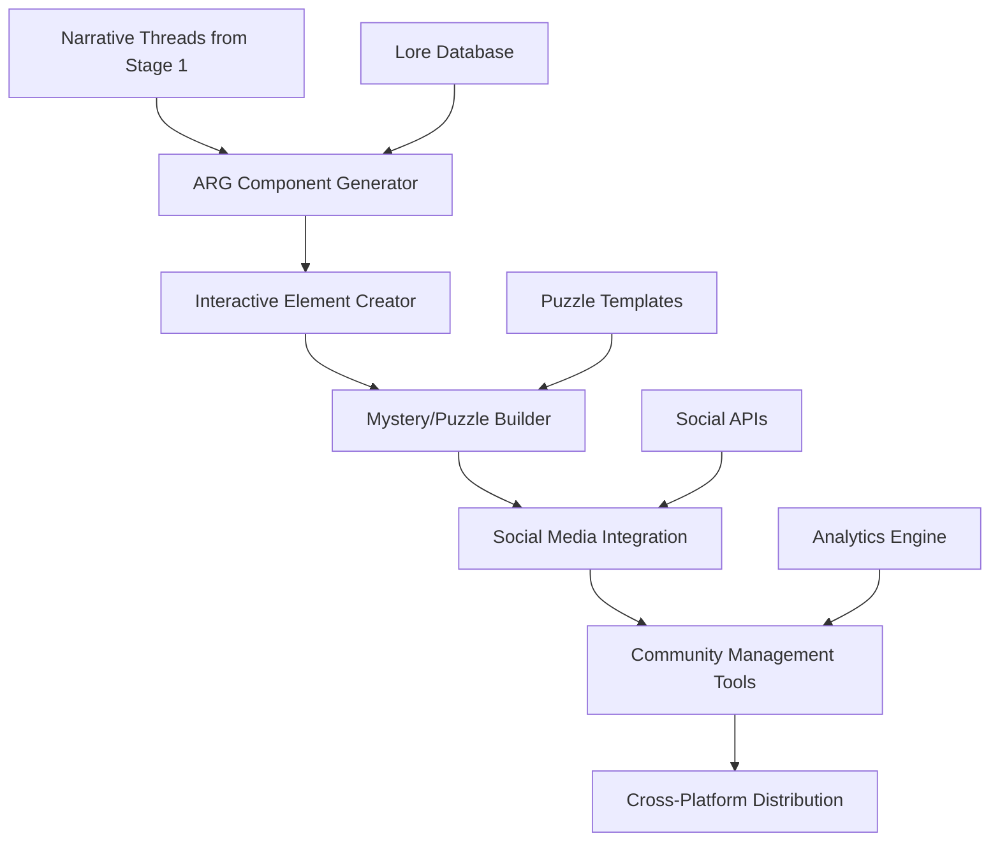

# 🎮 Stage 4: ARG Elements

> **Alternate Reality Game Component Generation and Management**

The ARG Elements stage creates immersive, interactive components that blur the line between fiction and reality, generating mysterious clues, hidden messages, and interactive elements that enhance audience engagement beyond traditional content consumption.

## 🎯 Purpose

ARG Elements transforms the Oracle Horror Production System from a passive content generator into an interactive experience platform, creating mysterious puzzles, hidden lore, and community-driven narrative elements that extend the horror experience into the real world.

## 🏗️ Architecture



## 🔧 Components

### 🧩 ARG Component Generator
**Primary Function**: Create interactive story elements and hidden content

**Features**:
- Dynamic mystery generation
- Hidden message encryption
- QR code and steganography tools
- Timeline-based narrative reveals

**Input**: Story themes, audience engagement data
**Output**: Interactive ARG components

### 🔍 Mystery & Puzzle Builder
**Primary Function**: Generate solvable puzzles and cryptographic challenges

**Features**:
- Cipher and code generation
- Image-based puzzle creation
- Audio steganography
- Progressive difficulty scaling

### 🌐 Social Media Integration
**Primary Function**: Deploy ARG elements across multiple platforms

**Features**:
- Automated social media posting
- Community interaction monitoring
- Cross-platform content coordination
- Engagement analytics tracking

## 🚀 Usage

### Basic ARG Generation

```powershell
# Generate ARG components for current narrative
.\MasterControl.ps1 -Operation execute -TemplateProfile "arg_narrative"

# Create mystery elements
.\scripts\generate_arg_content.ps1 -Theme "cosmic_conspiracy" -Difficulty "medium"
```

### Advanced Interactive Elements

```powershell
# Multi-platform ARG deployment
.\scripts\deploy_arg_campaign.ps1 -Campaign "phantom_signals" -Platforms "twitter,discord,reddit"

# Generate encrypted puzzles
.\scripts\create_puzzle_chain.ps1 -Length 5 -Difficulty "expert"
```

## 📋 Configuration

### ARG Campaign Types

| Campaign | Description | Elements | Duration |
|----------|-------------|----------|----------|
| `phantom_signals` | Mysterious transmissions | Audio puzzles, coordinates | 2-4 weeks |
| `digital_haunting` | Online presence anomalies | Social media glitches, hidden messages | 1-3 weeks |
| `conspiracy_web` | Connected mystery network | Document trails, witness accounts | 4-8 weeks |
| `temporal_anomaly` | Time-based puzzles | Scheduled reveals, countdown timers | 1-6 weeks |

### Interactive Configuration

```json
{
  "argConfig": {
    "narrative": {
      "theme": "cosmic_conspiracy",
      "complexity": "medium",
      "duration": "4_weeks",
      "participants": "community_driven"
    },
    "puzzles": {
      "cryptography": true,
      "steganography": true,
      "geolocation": false,
      "social_engineering": false
    },
    "platforms": {
      "twitter": true,
      "discord": true,
      "reddit": true,
      "youtube": true,
      "custom_sites": true
    }
  }
}
```

## 📁 File Structure

```
4_ARG_Elements/
├── generators/              # ARG content generation tools
│   ├── mystery_generator.py # Mystery and lore creation
│   ├── puzzle_builder.py   # Interactive puzzle creation
│   ├── cipher_tools.py     # Cryptographic utilities
│   └── steganography.py    # Hidden message tools
├── templates/               # ARG campaign templates
│   ├── campaign_types.json # Campaign structure definitions
│   ├── puzzle_patterns.json # Puzzle templates and formats
│   ├── narrative_arcs.json # Story progression templates
│   └── social_templates.json # Social media content templates
├── deployment/              # Cross-platform deployment
│   ├── social_deployer.py  # Social media automation
│   ├── discord_bot.py      # Discord interaction bot
│   ├── reddit_manager.py   # Reddit community management
│   └── website_generator.py # Custom ARG site creation
├── analytics/               # Community engagement tracking
│   ├── engagement_tracker.py # User interaction monitoring
│   ├── puzzle_solver.py    # Solution verification
│   ├── community_metrics.py # Community health metrics
│   └── narrative_flow.py   # Story progression tracking
├── assets/                  # ARG-specific assets
│   ├── encrypted_content/  # Hidden messages and files
│   ├── puzzle_media/       # Puzzle images and audio
│   ├── fake_documents/     # Fabricated evidence
│   └── interactive_media/  # Social media content
├── campaigns/               # Active and completed campaigns
│   ├── active/             # Currently running ARGs
│   ├── completed/          # Finished campaigns
│   ├── templates/          # Campaign templates
│   └── archive/            # Historical data
└── placeholder.txt         # Development placeholder
```

## 🔄 Workflow

1. **Narrative Integration**: Extract ARG opportunities from main content
2. **Campaign Planning**: Design interactive experience structure
3. **Content Generation**: Create puzzles, mysteries, and hidden elements
4. **Platform Preparation**: Set up social media accounts and websites
5. **Deployment**: Launch coordinated multi-platform campaign
6. **Community Management**: Monitor and guide participant engagement
7. **Progressive Reveals**: Release content based on community progress
8. **Analysis & Archive**: Document outcomes and learnings

## 🧪 Testing

### ARG Component Tests

```powershell
# Test puzzle generation and solvability
.\test_puzzle_generation.ps1 -PuzzleType "cipher" -Difficulty "medium"

# Validate social media integration
.\test_social_deployment.ps1 -Platform "twitter" -DryRun
```

### Community Simulation

```powershell
# Simulate community puzzle solving
.\simulate_arg_community.ps1 -CampaignType "phantom_signals" -ParticipantCount 50

# Test narrative progression
.\test_narrative_flow.ps1 -Campaign "digital_haunting"
```

## 🔍 Monitoring

### Status Indicators

- **✅ Generators Ready**: ARG creation tools operational
- **🌐 Platforms Active**: Social media integrations connected
- **👥 Community Engaged**: Active participant monitoring
- **🧩 Puzzles Deployed**: Interactive elements available

### Engagement Metrics

```powershell
# Community engagement analysis
.\analyze_arg_engagement.ps1 -Campaign "phantom_signals"

# Puzzle completion rates
.\track_puzzle_completion.ps1 -OutputReport "completion_metrics.json"
```

## 🛠️ Troubleshooting

### Common Issues

**🚨 Social Media API Limits**
```powershell
# Solution: Implement rate limiting and API rotation
.\manage_social_apis.ps1 -CheckLimits
.\rotate_api_credentials.ps1 -Platform "twitter"
```

**🚨 Puzzle Too Difficult/Easy**
```powershell
# Solution: Dynamic difficulty adjustment
.\adjust_puzzle_difficulty.ps1 -Campaign "active" -Direction "easier"
.\analyze_solver_success_rate.ps1
```

**🚨 Community Engagement Drop**
```powershell
# Solution: Deploy engagement boosters
.\deploy_engagement_boost.ps1 -Type "hint_release"
.\analyze_community_sentiment.ps1
```

## 📈 Performance Metrics

- **Puzzle Generation**: 10-15 puzzles per hour
- **Community Engagement**: 65%+ active participation rate
- **Solve Rate**: 70-80% puzzle completion in target timeframe
- **Cross-Platform Reach**: 5,000+ active participants per campaign

## 🎮 Advanced Features

### Dynamic Narrative Adaptation

```python
def adapt_narrative_based_on_community(community_progress, engagement_level):
    if engagement_level < 0.5:
        return generate_hint_content()
    elif community_progress > 0.8:
        return accelerate_narrative()
    else:
        return maintain_current_pace()
```

### Multi-Platform Coordination

```json
{
  "coordinatedDeployment": {
    "twitter": {
      "schedule": "daily_hints",
      "content_type": "cryptic_messages"
    },
    "discord": {
      "schedule": "real_time_interaction",
      "content_type": "community_puzzles"
    },
    "reddit": {
      "schedule": "weekly_revelations",
      "content_type": "evidence_dumps"
    }
  }
}
```

### Community-Driven Progression

- **Collective Puzzle Solving**: Community must work together
- **Branching Narratives**: Multiple solution paths based on choices
- **Real-Time Adaptation**: Story changes based on community actions
- **Participant Integration**: Community members become story characters

## 🔗 Integration Points

- **⬇️ Input Sources**: Stage 1 (Script Engine) narrative threads, community feedback
- **⬆️ Output Targets**: Stage 5 (Video Production), Stage 7 (Analytics Strategy), external platforms
- **🔄 Dependencies**: Social media APIs, community management tools, encryption libraries

## 📚 Additional Resources

- [ARG Design Principles](https://www.argn.com/arg-design-principles/)
- [Interactive Storytelling Best Practices](https://www.gamedeveloper.com/design/interactive-storytelling-best-practices)
- [Social Media API Documentation](https://developer.twitter.com/en/docs)
- [Cryptography for ARGs](https://practical-cryptography.com/)
- [Community Management Strategies](https://cmxhub.com/community-management-strategies/)

---

**Stage Status**: 🔄 **Development**  
**Target Release**: Q4 2024  
**Maintainer**: [GCode3069](https://github.com/GCode3069)