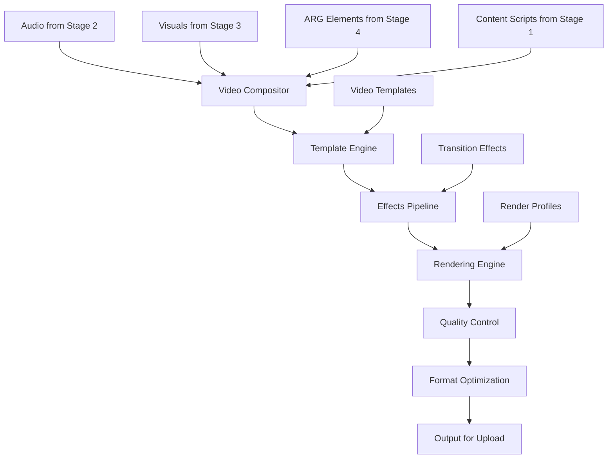

# 🎥 Stage 5: Video Production

> **Advanced Video Rendering and Composition Pipeline**

The Video Production stage is the heart of the visual output system, combining audio from Stage 2, visual assets from Stage 3, and interactive elements from Stage 4 into polished, production-ready video content optimized for YouTube deployment.

## 🎯 Purpose

Video Production orchestrates the final assembly of all content elements into compelling horror-themed videos, applying professional editing techniques, visual effects, and optimization for maximum audience engagement and platform compatibility.

## 🏗️ Architecture



## 🔧 Components

### 🎬 Video Compositor
**Primary Function**: Combine multiple media elements into cohesive video content

**Features**:
- Multi-track audio/video composition
- Synchronized timing and pacing
- Dynamic content insertion
- Template-based assembly

**Technologies**: FFmpeg, Adobe After Effects API, DaVinci Resolve API

### 🎨 Effects Pipeline
**Primary Function**: Apply professional visual effects and transitions

**Features**:
- Horror-themed visual effects
- Dynamic text overlays and animations
- Atmospheric lighting and color grading
- Audio-visual synchronization effects

### 🖥️ Rendering Engine
**Primary Function**: Generate final video files with optimal quality and compression

**Features**:
- Multi-resolution rendering
- Platform-specific optimization
- Hardware-accelerated encoding
- Batch processing capabilities

## 🚀 Usage

### Basic Video Production

```powershell
# Render videos from current pipeline content
.\MasterControl.ps1 -Operation execute -TemplateProfile "tech_alerts"

# Generate specific number of videos
.\scripts\render_video_batch.ps1 -Count 20 -Quality "high"
```

### Advanced Production

```powershell
# Custom template rendering
.\scripts\render_with_template.ps1 -Template "cosmic_horror" -AudioFiles 15

# High-quality cinematic rendering
.\scripts\cinematic_render.ps1 -Profile "4K_HDR" -Effects "enhanced"
```

## 📋 Configuration

### Video Templates

| Template | Description | Duration | Style | Use Case |
|----------|-------------|----------|-------|----------|
| `tech_alerts` | Technical emergency broadcasts | 2-5 min | Documentary | Educational horror |
| `cosmic_horror` | Lovecraftian space themes | 3-8 min | Cinematic | Atmospheric content |
| `urban_legends` | Modern myth adaptations | 4-6 min | Found footage | Viral content |
| `conspiracy_docs` | Investigative documentaries | 5-12 min | Professional | Deep-dive content |

### Rendering Profiles

```json
{
  "renderProfiles": {
    "youtube_standard": {
      "resolution": "1920x1080",
      "framerate": 30,
      "bitrate": "8000k",
      "audio": "192kbps",
      "format": "mp4",
      "codec": "h264"
    },
    "youtube_high": {
      "resolution": "2560x1440",
      "framerate": 60,
      "bitrate": "16000k",
      "audio": "320kbps",
      "format": "mp4",
      "codec": "h265"
    },
    "cinema_4k": {
      "resolution": "3840x2160",
      "framerate": 24,
      "bitrate": "45000k",
      "audio": "320kbps",
      "format": "mov",
      "codec": "prores"
    }
  }
}
```

## 📁 File Structure

```
5_Video_Production/
├── compositor/              # Video composition tools
│   ├── ffmpeg_compositor.py # FFmpeg-based composition
│   ├── ae_compositor.py     # After Effects integration
│   ├── timeline_builder.py # Timeline construction
│   └── sync_manager.py     # Audio-video synchronization
├── templates/               # Video template definitions
│   ├── tech_alerts/        # Technical alert templates
│   ├── cosmic_horror/      # Cosmic horror templates  
│   ├── urban_legends/      # Urban legend templates
│   └── conspiracy_docs/    # Documentary templates
├── effects/                 # Visual effects library
│   ├── transitions/        # Scene transition effects
│   ├── overlays/           # Text and graphic overlays
│   ├── particles/          # Particle systems
│   └── atmospheric/        # Atmospheric effects
├── rendering/               # Rendering pipeline
│   ├── render_engine.py    # Core rendering functionality
│   ├── quality_control.py  # Automated QC validation
│   ├── optimization.py     # Platform-specific optimization
│   └── batch_renderer.py   # Batch processing system
├── output/                  # Rendered video staging
│   ├── raw_renders/        # Initial renders
│   ├── processed/          # Post-processed videos
│   ├── optimized/          # Platform-optimized versions
│   └── final/              # Upload-ready videos
├── cache/                   # Rendering cache and temp files
│   ├── preview_cache/      # Preview rendering cache
│   ├── render_cache/       # Rendering optimization cache
│   └── temp_files/         # Temporary working files
└── placeholder.txt         # Development placeholder
```

## 🔄 Workflow

1. **Asset Collection**: Gather audio, visual, and text elements from previous stages
2. **Template Selection**: Choose appropriate video template based on content type
3. **Timeline Construction**: Build synchronized multimedia timeline
4. **Effect Application**: Apply visual effects, transitions, and enhancements
5. **Rendering**: Generate video files using specified quality profiles
6. **Quality Control**: Automated validation of output quality and compliance
7. **Optimization**: Platform-specific encoding and compression
8. **Staging**: Prepare final videos for upload to YouTube

## 🧪 Testing

### Rendering Quality Tests

```powershell
# Test template rendering
.\test_template_rendering.ps1 -Template "tech_alerts" -SampleCount 3

# Validate rendering pipeline
.\test_rendering_pipeline.ps1 -Profile "youtube_standard"
```

### Performance Benchmarks

```powershell
# Benchmark rendering speeds
.\benchmark_rendering.ps1 -Duration "5min" -Quality "high"

# Test concurrent rendering
.\test_concurrent_renders.ps1 -Jobs 4 -QueueSize 20
```

## 🔍 Monitoring

### Status Indicators

- **✅ Tested**: Video composer operational and validated
- **🎥 Ready**: Rendering engines available and configured
- **📁 Loaded**: Templates and effects library accessible
- **⚡ Processing**: Active rendering jobs in progress

### Performance Metrics

```powershell
# Rendering performance analysis
.\analyze_render_performance.ps1 -OutputReport "performance.json"

# Quality metrics evaluation
.\evaluate_video_quality.ps1 -SampleSize 10
```

## 🛠️ Troubleshooting

### Common Issues

**🚨 Rendering Failures**
```powershell
# Solution: Check system resources and codec availability
.\diagnose_rendering_issues.ps1
.\validate_codecs.ps1
.\check_system_resources.ps1
```

**🚨 Audio-Video Sync Issues**
```powershell
# Solution: Recalibrate synchronization settings
.\recalibrate_sync.ps1
.\test_av_sync.ps1 -SampleVideo "test_render.mp4"
```

**🚨 Template Loading Errors**
```powershell
# Solution: Validate and reload templates
.\validate_templates.ps1 -TemplatePath "templates/"
.\reload_templates.ps1 -Force
```

## 📈 Performance Metrics

- **Rendering Speed**: 1:1 ratio (5-minute video renders in ~5 minutes)
- **Processing Throughput**: 20 videos per hour (standard quality)
- **Quality Score**: 98%+ automated QC pass rate
- **Efficiency**: 85% GPU utilization during rendering

## 🎬 Advanced Features

### Dynamic Template System

```python
def build_dynamic_template(content_type, duration, mood):
    template = load_base_template(content_type)
    template.adjust_pacing(duration)
    template.apply_mood_filters(mood)
    template.add_contextual_effects()
    return template
```

### Real-Time Preview

```json
{
  "previewSystem": {
    "enabled": true,
    "resolution": "720p",
    "framerate": 15,
    "updateInterval": "500ms",
    "cacheSize": "2GB"
  }
}
```

### Multi-Platform Optimization

- **YouTube**: Optimal compression for platform algorithms
- **TikTok**: Vertical format adaptation
- **Instagram**: Square and story format variants
- **Twitter**: Length and quality optimization for social sharing

### Automated Quality Control

```python
def automated_qc_check(video_file):
    checks = [
        validate_resolution(),
        check_audio_levels(),
        verify_framerate(),
        test_color_accuracy(),
        validate_duration(),
        check_compression_artifacts()
    ]
    return all(checks)
```

## 🔗 Integration Points

- **⬇️ Input Sources**: Stage 2 (Voiceover Vault), Stage 3 (Visual Assets), Stage 4 (ARG Elements)
- **⬆️ Output Targets**: Stage 6 (Monetization), YouTube upload system
- **🔄 Dependencies**: FFmpeg, video codecs, GPU acceleration, storage systems

## 📚 Additional Resources

- [FFmpeg Documentation](https://ffmpeg.org/documentation.html)
- [YouTube Creator Best Practices](https://support.google.com/youtube/answer/1722171)
- [Video Optimization Guide](https://developer.mozilla.org/en-US/docs/Web/Media/Formats/Video_codecs)
- [Color Grading Techniques](https://www.premiumbeat.com/blog/color-grading-techniques/)
- [Audio-Video Synchronization](https://en.wikipedia.org/wiki/Audio_to_video_synchronization)

---

**Stage Status**: ✅ **Operational**  
**Last Updated**: August 2024  
**Maintainer**: [GCode3069](https://github.com/GCode3069)