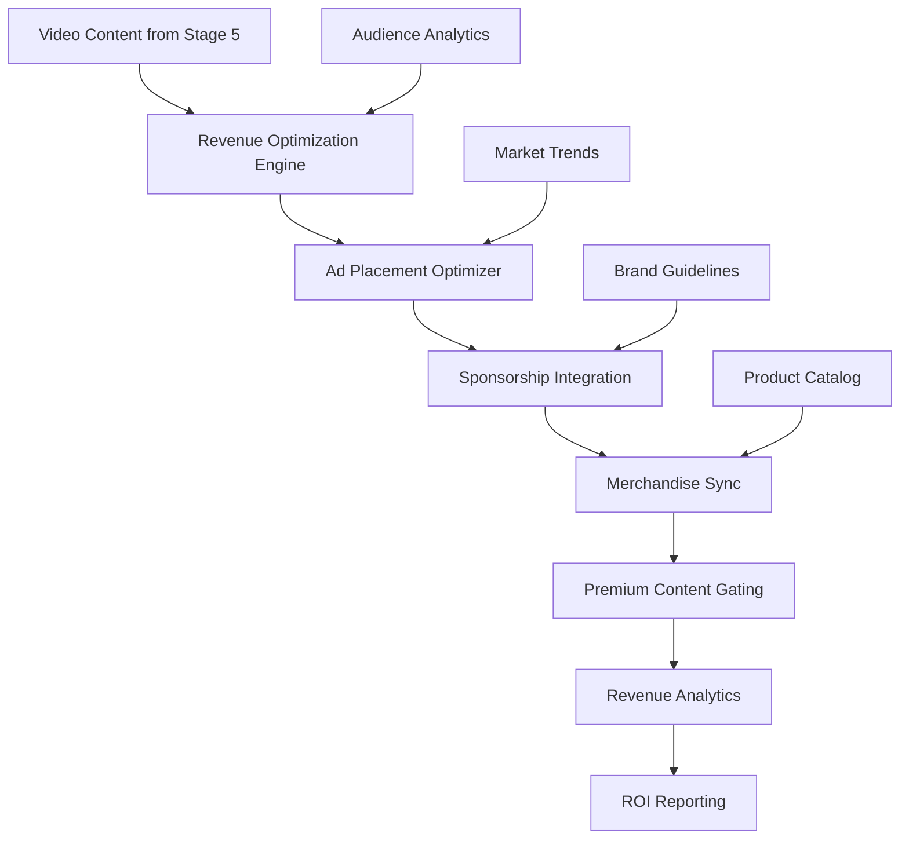

# 💰 Stage 6: Monetization

> **Revenue Optimization and Analytics Engine**

The Monetization stage maximizes revenue potential through intelligent content optimization, audience analytics, and multi-platform revenue stream management, ensuring sustainable growth and profitability for the Oracle Horror Production System.

## 🎯 Purpose

Monetization transforms content engagement into sustainable revenue through strategic optimization of ad placements, sponsorship integration, merchandise opportunities, and premium content offerings while maintaining audience satisfaction and content quality.

## 🏗️ Architecture



## 🔧 Components

### 📊 Revenue Optimization Engine
**Primary Function**: Maximize revenue potential across all content

**Features**:
- Dynamic ad placement optimization
- Audience segment targeting
- Revenue prediction modeling
- A/B testing for monetization strategies

**Technologies**: YouTube Analytics API, Google AdSense, custom ML models

### 🎯 Sponsorship Integration Manager
**Primary Function**: Seamlessly integrate sponsored content and brand partnerships

**Features**:
- Brand-safe content validation
- Sponsorship opportunity identification
- Automated disclosure compliance
- Partnership performance tracking

### 🛍️ Merchandise Synchronization
**Primary Function**: Coordinate merchandise offerings with content themes

**Features**:
- Theme-based product recommendations
- Inventory management integration
- Cross-promotion optimization
- Sales performance tracking

## 🚀 Usage

### Basic Revenue Optimization

```powershell
# Optimize monetization for current content batch
.\MasterControl.ps1 -Operation execute -ConfigPath "config/monetization.json"

# Analyze revenue performance
.\scripts\analyze_revenue.ps1 -Period "30days" -OutputReport "revenue_analysis.json"
```

### Advanced Revenue Management

```powershell
# A/B test monetization strategies
.\scripts\ab_test_monetization.ps1 -Strategy "aggressive_ads" -TestDuration "7days"

# Optimize sponsorship integration
.\scripts\optimize_sponsorships.ps1 -ContentType "cosmic_horror" -BrandSafety "high"
```

## 📋 Configuration

### Revenue Strategies

| Strategy | Description | Revenue Focus | Risk Level |
|----------|-------------|---------------|------------|
| `conservative` | Minimal ads, high engagement | Long-term growth | Low |
| `balanced` | Moderate ad density | Steady revenue | Medium |
| `aggressive` | Maximum ad revenue | Short-term gains | High |
| `premium_focus` | Subscription-based model | Recurring revenue | Medium |

### Monetization Settings

```json
{
  "monetizationConfig": {
    "adSettings": {
      "preRollEnabled": true,
      "midRollDensity": "medium",
      "postRollEnabled": true,
      "skipableAfter": 5,
      "maxAdDuration": 30
    },
    "sponsorships": {
      "enabled": true,
      "brandSafetyLevel": "high",
      "maxSponsorsPerVideo": 2,
      "disclosureCompliance": "strict"
    },
    "merchandise": {
      "autoRecommend": true,
      "crossPromote": true,
      "seasonalOptimization": true,
      "inventorySync": true
    },
    "premiumContent": {
      "gatingEnabled": false,
      "tierLevels": 3,
      "exclusiveContent": true,
      "earlyAccess": true
    }
  }
}
```

## 📁 File Structure

```
6_Monetization/
├── optimization/            # Revenue optimization engines
│   ├── ad_optimizer.py     # Ad placement optimization
│   ├── audience_analyzer.py # Audience segmentation
│   ├── revenue_predictor.py # Revenue forecasting ML
│   └── ab_testing.py       # A/B testing framework
├── sponsorships/           # Sponsorship management
│   ├── brand_matcher.py    # Brand-content matching
│   ├── integration_tools.py # Sponsorship integration
│   ├── compliance_check.py # Disclosure compliance
│   └── performance_tracker.py # Partnership ROI
├── merchandise/            # Merchandise coordination
│   ├── product_recommender.py # Theme-based recommendations
│   ├── inventory_sync.py   # Inventory management
│   ├── cross_promoter.py   # Cross-promotion tools
│   └── sales_tracker.py    # Sales performance
├── analytics/              # Revenue analytics
│   ├── revenue_dashboard.py # Real-time revenue dashboard
│   ├── roi_calculator.py   # Return on investment
│   ├── trend_analyzer.py   # Revenue trend analysis
│   └── competitor_analysis.py # Market comparison
├── premium/                # Premium content management
│   ├── tier_manager.py     # Subscription tier management
│   ├── content_gating.py   # Premium content gating
│   ├── subscriber_analytics.py # Premium subscriber metrics
│   └── retention_optimizer.py # Subscriber retention
├── reports/                # Revenue reporting
│   ├── daily_reports/      # Daily revenue summaries
│   ├── monthly_analysis/   # Monthly performance analysis
│   ├── roi_reports/        # Return on investment reports
│   └── forecasts/          # Revenue predictions
└── placeholder.txt         # Development placeholder
```

## 🔄 Workflow

1. **Content Analysis**: Evaluate content for monetization potential
2. **Strategy Selection**: Choose optimal monetization approach
3. **Ad Optimization**: Configure advertising placement and density
4. **Sponsorship Matching**: Identify relevant brand partnerships
5. **Merchandise Sync**: Align product offerings with content themes
6. **Performance Monitoring**: Track revenue metrics and engagement
7. **Optimization Iteration**: Refine strategies based on performance data
8. **ROI Reporting**: Generate comprehensive revenue analysis

## 🧪 Testing

### Revenue Strategy Tests

```powershell
# Test different monetization strategies
.\test_monetization_strategies.ps1 -Strategies "conservative,aggressive"

# Validate ad placement optimization
.\test_ad_optimization.ps1 -ContentSample "tech_alerts"
```

### Performance Simulation

```powershell
# Simulate revenue scenarios
.\simulate_revenue_scenarios.ps1 -Duration "90days" -Strategy "balanced"

# Test sponsorship integration
.\test_sponsorship_integration.ps1 -Brand "TechCorp" -ContentType "cosmic_horror"
```

## 🔍 Monitoring

### Status Indicators

- **✅ Optimized**: Revenue optimization engines operational
- **💰 Active**: Monetization strategies deployed
- **📈 Tracking**: Performance analytics collecting data
- **🎯 Targeted**: Audience segmentation active

### Revenue Metrics

```powershell
# Real-time revenue dashboard
.\show_revenue_dashboard.ps1

# Generate revenue performance report
.\generate_revenue_report.ps1 -Period "monthly" -Format "detailed"
```

## 🛠️ Troubleshooting

### Common Issues

**🚨 Ad Revenue Decline**
```powershell
# Solution: Analyze and adjust ad strategy
.\diagnose_ad_performance.ps1
.\optimize_ad_placement.ps1 -Strategy "recovery_mode"
```

**🚨 Sponsorship Compliance Issues**
```powershell
# Solution: Audit and fix compliance violations
.\audit_sponsorship_compliance.ps1
.\fix_disclosure_issues.ps1 -AutoCorrect
```

**🚨 Merchandise Sales Drop**
```powershell
# Solution: Refresh product recommendations
.\refresh_product_recommendations.ps1
.\analyze_merchandise_performance.ps1 -Period "30days"
```

## 📈 Performance Metrics

- **Revenue Per Video**: $50-200 (varies by content type and audience)
- **Ad Click-Through Rate**: 2.5-4.2%
- **Sponsorship Conversion**: 15-25% viewer engagement
- **Merchandise Conversion**: 1.5-3.2% of viewers

## 💡 Advanced Features

### Dynamic Revenue Optimization

```python
def optimize_revenue_strategy(content_metrics, audience_data, market_trends):
    strategy = analyze_optimal_approach(content_metrics)
    audience_segments = segment_audience(audience_data)
    market_position = assess_market_trends(market_trends)
    
    return build_monetization_plan(strategy, audience_segments, market_position)
```

### Predictive Revenue Modeling

```json
{
  "revenuePrediction": {
    "model": "lstm_forecaster",
    "trainingData": "12_months_historical",
    "factors": [
      "content_type",
      "audience_engagement",
      "seasonal_trends",
      "market_competition"
    ],
    "accuracy": "85%",
    "forecastHorizon": "90_days"
  }
}
```

### Multi-Platform Revenue Optimization

- **YouTube**: Ad revenue, channel memberships, super chat
- **Patreon**: Subscription tiers, exclusive content
- **Merchandise**: Theme-based products, limited editions
- **Licensing**: Content licensing to other creators
- **Premium Services**: Consulting, custom content creation

### Automated A/B Testing

```python
def run_monetization_ab_test(strategy_a, strategy_b, duration_days):
    test_groups = split_audience_randomly()
    apply_strategy(test_groups['A'], strategy_a)
    apply_strategy(test_groups['B'], strategy_b)
    
    results = monitor_for_duration(duration_days)
    return statistical_analysis(results)
```

## 🔗 Integration Points

- **⬇️ Input Sources**: Stage 5 (Video Production), Stage 7 (Analytics Strategy), market data
- **⬆️ Output Targets**: Financial reporting, content optimization feedback, audience insights
- **🔄 Dependencies**: YouTube Analytics API, AdSense API, payment processors, inventory systems

## 📚 Additional Resources

- [YouTube Monetization Policies](https://support.google.com/youtube/answer/1311392)
- [Google AdSense Best Practices](https://support.google.com/adsense/answer/1348754)
- [FTC Disclosure Guidelines](https://www.ftc.gov/tips-advice/business-center/guidance/ftcs-endorsement-guides-what-people-are-asking)
- [Revenue Optimization Strategies](https://blog.hubspot.com/marketing/revenue-optimization)
- [Creator Economy Insights](https://influencermarketinghub.com/creator-economy-report/)

---

**Stage Status**: 🔄 **Development**  
**Target Release**: Q1 2025  
**Maintainer**: [GCode3069](https://github.com/GCode3069)