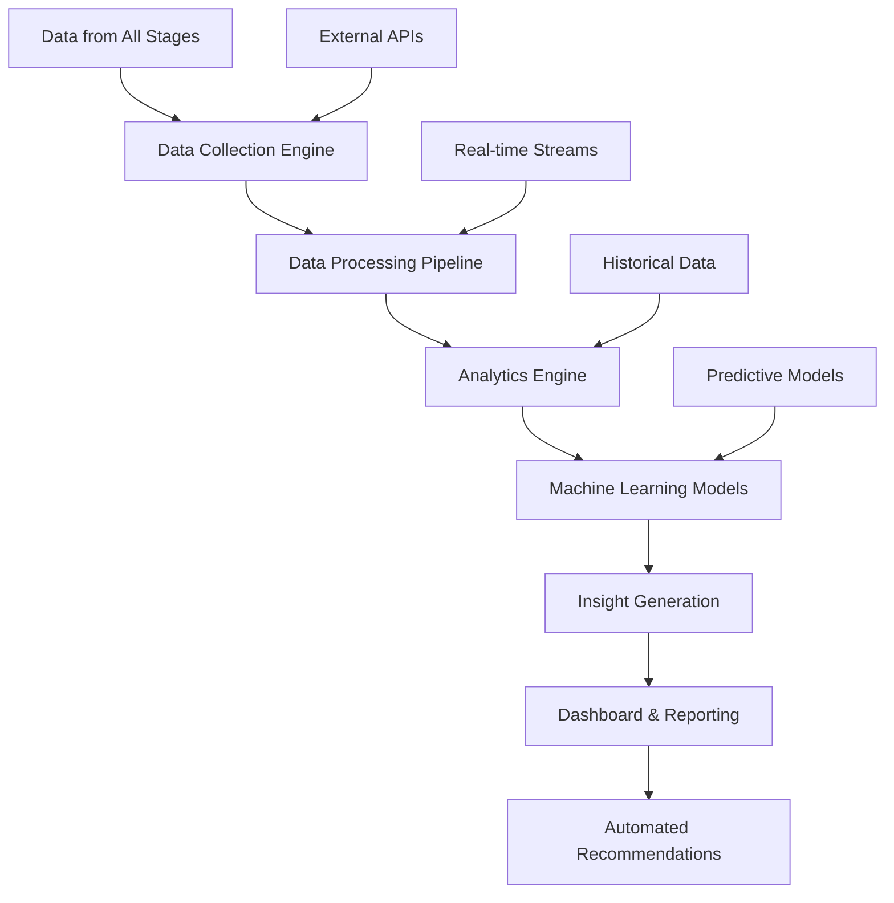

# 📊 Stage 7: Analytics Strategy

> **Advanced Performance Tracking and Intelligence Engine**

The Analytics Strategy stage provides comprehensive data intelligence for the Oracle Horror Production System, delivering actionable insights on audience behavior, content performance, market trends, and system optimization opportunities.

## 🎯 Purpose

Analytics Strategy transforms raw data from all pipeline stages into strategic intelligence, enabling data-driven decision making, performance optimization, and predictive content planning to maximize audience engagement and system efficiency.

## 🏗️ Architecture



## 🔧 Components

### 📈 Data Collection Engine
**Primary Function**: Aggregate data from all system components and external sources

**Features**:
- Multi-source data ingestion
- Real-time streaming analytics
- API integration management
- Data quality validation

**Data Sources**: YouTube Analytics, Social Media APIs, System Logs, User Interactions

### 🧠 Machine Learning Pipeline
**Primary Function**: Generate predictive insights and recommendations

**Features**:
- Audience behavior prediction
- Content performance forecasting
- Trend analysis and pattern recognition
- Anomaly detection and alerting

### 📊 Intelligence Dashboard
**Primary Function**: Visualize data and insights for strategic decision making

**Features**:
- Real-time performance monitoring
- Interactive data exploration
- Automated report generation
- Custom metric tracking

## 🚀 Usage

### Basic Analytics

```powershell
# Generate comprehensive analytics report
.\MasterControl.ps1 -Operation analytics -Period "30days"

# Monitor real-time performance
.\scripts\monitor_realtime.ps1 -Dashboard "production"
```

### Advanced Intelligence

```powershell
# Run predictive analysis
.\scripts\predict_performance.ps1 -ContentType "cosmic_horror" -Horizon "30days"

# Generate strategic recommendations
.\scripts\generate_recommendations.ps1 -Focus "audience_growth"
```

## 📋 Configuration

### Analytics Modules

| Module | Description | Update Frequency | Data Sources |
|--------|-------------|------------------|--------------|
| `audience_analytics` | Viewer behavior and demographics | Real-time | YouTube, Social APIs |
| `content_performance` | Video metrics and engagement | Hourly | YouTube Analytics |
| `system_performance` | Pipeline efficiency metrics | Real-time | System logs |
| `market_intelligence` | Trend and competitor analysis | Daily | External APIs |

### Data Collection Settings

```json
{
  "analyticsConfig": {
    "dataCollection": {
      "realtimeEnabled": true,
      "batchProcessing": true,
      "retentionPeriod": "2_years",
      "samplingRate": "100%"
    },
    "processing": {
      "aggregationInterval": "1_hour",
      "mlModelRefresh": "weekly",
      "anomalyDetection": true,
      "trendAnalysis": true
    },
    "reporting": {
      "dashboardRefresh": "5_minutes",
      "alertThresholds": {
        "performance_drop": 15,
        "engagement_drop": 20,
        "error_rate": 5
      }
    }
  }
}
```

## 📁 File Structure

```
7_Analytics_Strategy/
├── collection/              # Data collection engines
│   ├── youtube_collector.py # YouTube Analytics API
│   ├── social_collector.py  # Social media data
│   ├── system_collector.py  # Internal system metrics
│   └── market_collector.py  # Market intelligence
├── processing/              # Data processing pipeline
│   ├── data_cleaner.py     # Data cleaning and validation
│   ├── aggregator.py       # Data aggregation engine
│   ├── transformer.py      # Data transformation
│   └── enricher.py         # Data enrichment
├── models/                  # Machine learning models
│   ├── audience_predictor.py # Audience behavior prediction
│   ├── content_optimizer.py # Content optimization ML
│   ├── trend_detector.py   # Trend analysis models
│   └── anomaly_detector.py # System anomaly detection
├── intelligence/            # Analytics intelligence
│   ├── insight_generator.py # Automated insight generation
│   ├── recommendation_engine.py # Strategic recommendations
│   ├── competitor_analysis.py # Market competition analysis
│   └── performance_analyzer.py # Performance analysis
├── dashboards/              # Analytics dashboards
│   ├── realtime_dashboard.py # Real-time monitoring
│   ├── executive_dashboard.py # High-level overview
│   ├── content_dashboard.py # Content performance
│   └── audience_dashboard.py # Audience analytics
├── reports/                 # Generated reports
│   ├── daily_reports/      # Daily performance summaries
│   ├── weekly_analysis/    # Weekly trend analysis
│   ├── monthly_insights/   # Monthly strategic insights
│   └── quarterly_reviews/  # Quarterly performance reviews
├── data/                    # Analytics data storage
│   ├── raw_data/           # Raw collected data
│   ├── processed_data/     # Cleaned and processed data
│   ├── aggregated_data/    # Aggregated metrics
│   └── ml_datasets/        # Machine learning datasets
└── placeholder.txt         # Development placeholder
```

## 🔄 Workflow

1. **Data Collection**: Gather data from all system components and external sources
2. **Data Processing**: Clean, validate, and transform raw data
3. **Analysis Execution**: Run analytical models and statistical analysis
4. **Insight Generation**: Extract actionable insights and patterns
5. **Prediction Modeling**: Generate forecasts and recommendations
6. **Dashboard Updates**: Refresh real-time monitoring dashboards
7. **Report Generation**: Create automated strategic reports
8. **Recommendation Delivery**: Provide optimization suggestions to other stages

## 🧪 Testing

### Analytics Pipeline Tests

```powershell
# Test data collection accuracy
.\test_data_collection.ps1 -Source "youtube" -Period "24hours"

# Validate ML model performance
.\test_ml_models.ps1 -Model "audience_predictor" -TestDataset "validation"
```

### Data Quality Tests

```powershell
# Validate data integrity
.\test_data_integrity.ps1 -Dataset "content_performance"

# Test dashboard functionality
.\test_dashboards.ps1 -Dashboard "realtime" -MockData
```

## 🔍 Monitoring

### Status Indicators

- **✅ Collecting**: Data collection engines operational
- **🧠 Processing**: ML models running and updated
- **📊 Available**: Dashboards accessible and current
- **🎯 Insights**: Recommendations generated and actionable

### Performance Metrics

```powershell
# Analytics system health check
.\check_analytics_health.ps1

# Data processing performance
.\analyze_processing_performance.ps1 -OutputReport "processing_metrics.json"
```

## 🛠️ Troubleshooting

### Common Issues

**🚨 Data Collection Failures**
```powershell
# Solution: Diagnose and repair data collection
.\diagnose_data_collection.ps1
.\repair_data_collectors.ps1 -Source "youtube"
```

**🚨 ML Model Degradation**
```powershell
# Solution: Retrain and validate models
.\retrain_ml_models.ps1 -Model "audience_predictor"
.\validate_model_performance.ps1 -Threshold 0.85
```

**🚨 Dashboard Performance Issues**
```powershell
# Solution: Optimize dashboard queries and caching
.\optimize_dashboard_performance.ps1
.\refresh_dashboard_cache.ps1 -Dashboard "all"
```

## 📈 Performance Metrics

- **Data Processing Speed**: 1M+ records per minute
- **ML Model Accuracy**: 87%+ prediction accuracy
- **Dashboard Load Time**: <3 seconds for all visualizations
- **Insight Generation**: 50+ actionable insights per day

## 🧠 Advanced Features

### Predictive Content Analysis

```python
def predict_content_performance(content_metadata, audience_profile, market_trends):
    # Feature engineering
    features = engineer_features(content_metadata, audience_profile)
    
    # Model prediction
    performance_score = content_model.predict(features)
    engagement_forecast = engagement_model.predict(features)
    
    return {
        'predicted_views': performance_score['views'],
        'predicted_engagement': engagement_forecast,
        'recommendations': generate_optimization_tips(features)
    }
```

### Real-Time Anomaly Detection

```json
{
  "anomalyDetection": {
    "algorithms": ["isolation_forest", "statistical_outliers"],
    "metrics": [
      "view_velocity",
      "engagement_rate",
      "system_performance",
      "error_rates"
    ],
    "alerting": {
      "severity_levels": ["low", "medium", "high", "critical"],
      "notification_channels": ["email", "slack", "dashboard"]
    }
  }
}
```

### Audience Segmentation Intelligence

- **Behavioral Segmentation**: Group viewers by interaction patterns
- **Demographic Analysis**: Age, location, and device preference insights
- **Engagement Profiling**: Deep vs. casual viewer identification
- **Retention Modeling**: Predict viewer retention and churn

### Competitive Intelligence

```python
def analyze_competitor_performance(competitor_channels, time_period):
    competitor_data = collect_competitor_metrics(competitor_channels)
    market_trends = analyze_market_trends(time_period)
    
    insights = {
        'content_gaps': identify_content_opportunities(competitor_data),
        'trending_topics': extract_trending_topics(competitor_data),
        'best_practices': identify_successful_strategies(competitor_data),
        'market_position': assess_competitive_position(competitor_data)
    }
    
    return insights
```

## 🔗 Integration Points

- **⬇️ Input Sources**: All pipeline stages, YouTube Analytics, social media APIs, system logs
- **⬆️ Output Targets**: All pipeline stages (optimization feedback), executive reporting, strategy planning
- **🔄 Dependencies**: Analytics APIs, ML libraries, database systems, visualization tools

## 📊 Key Insights Delivered

### Content Optimization
- **Best Performing Content Types**: Data-driven content strategy
- **Optimal Posting Times**: Audience activity pattern analysis  
- **Engagement Drivers**: Factors that increase viewer interaction
- **Retention Optimization**: Strategies to reduce viewer drop-off

### Audience Intelligence  
- **Growth Opportunities**: Untapped audience segments
- **Engagement Patterns**: How different audiences interact
- **Preference Analysis**: Content preferences by segment
- **Behavior Prediction**: Forecasting audience actions

### System Performance
- **Pipeline Efficiency**: Bottleneck identification and optimization
- **Resource Utilization**: System resource optimization opportunities
- **Error Pattern Analysis**: Proactive issue prevention
- **Scalability Planning**: Growth capacity recommendations

## 📚 Additional Resources

- [YouTube Analytics API Documentation](https://developers.google.com/youtube/analytics)
- [Google Analytics for Creators](https://support.google.com/youtube/answer/1714323)
- [Data Science Best Practices](https://www.kdnuggets.com/2020/11/data-science-best-practices.html)
- [Machine Learning for Content Optimization](https://towardsdatascience.com/machine-learning-for-content-optimization)
- [Real-Time Analytics Architecture](https://aws.amazon.com/real-time-analytics/)

---

**Stage Status**: 🔄 **Development**  
**Target Release**: Q1 2025  
**Maintainer**: [GCode3069](https://github.com/GCode3069)