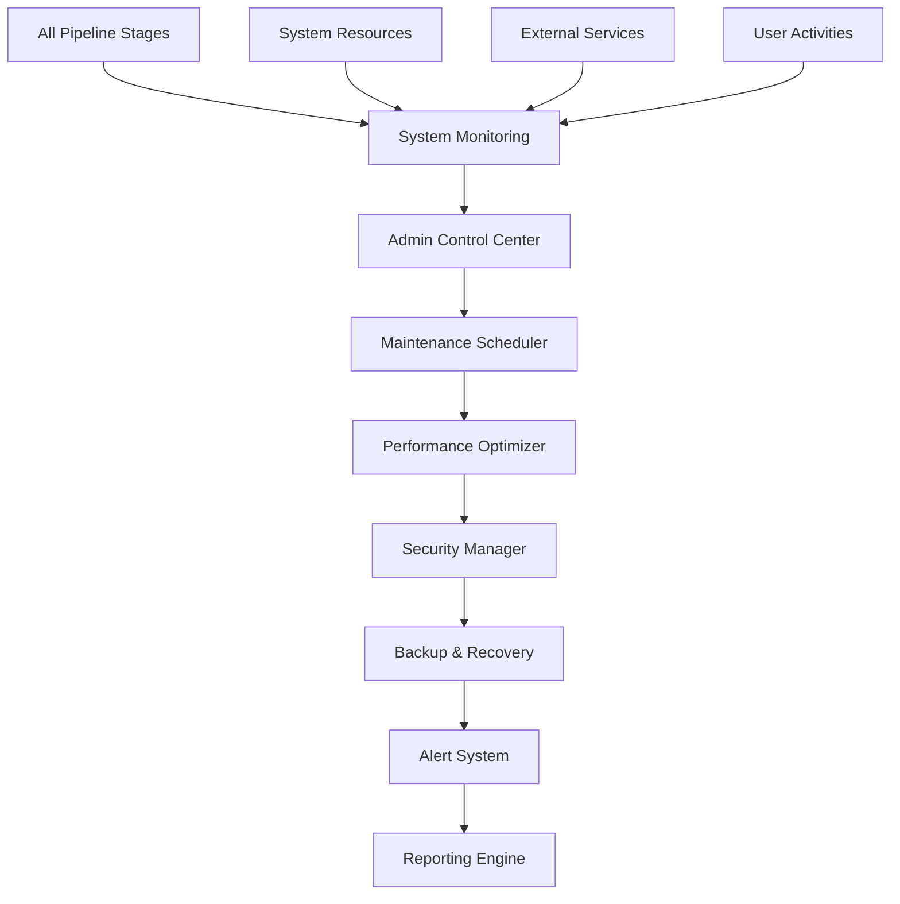

# ⚙️ Stage 8: Admin

> **System Administration and Maintenance Hub**

The Admin stage provides comprehensive system administration, monitoring, and maintenance capabilities for the Oracle Horror Production System, ensuring optimal performance, security, and reliability across all pipeline components.

## 🎯 Purpose

Admin serves as the central command center for system operations, providing tools for monitoring, maintenance, troubleshooting, and optimization of the entire Oracle Horror Production System infrastructure and pipeline operations.

## 🏗️ Architecture



## 🔧 Components

### 🖥️ System Monitor
**Primary Function**: Real-time monitoring of all system components and resources

**Features**:
- Pipeline stage health monitoring
- System resource utilization tracking
- API connectivity validation
- Performance metrics collection

**Monitoring Scope**: CPU, memory, disk, network, API limits, error rates

### 🔧 Maintenance Automation
**Primary Function**: Automated system maintenance and optimization tasks

**Features**:
- Scheduled maintenance routines
- Cache cleanup and optimization
- Log rotation and archival
- System health diagnostics

### 🔒 Security Management
**Primary Function**: System security monitoring and threat detection

**Features**:
- API key rotation and validation
- Access control management
- Security audit logging
- Vulnerability scanning

## 🚀 Usage

### Basic Administration

```powershell
# System status overview
.\MasterControl.ps1 -Operation status

# Run system diagnostics
.\scripts\system_diagnostics.ps1 -Comprehensive

# Perform maintenance tasks
.\scripts\maintenance_routine.ps1 -Tasks "cleanup,optimize,validate"
```

### Advanced Administration

```powershell
# Security audit
.\scripts\security_audit.ps1 -GenerateReport

# Performance optimization
.\scripts\optimize_system.ps1 -Target "all_stages" -Level "aggressive"

# Emergency system recovery
.\scripts\emergency_recovery.ps1 -RestorePoint "latest"
```

## 📋 Configuration

### Admin Modules

| Module | Description | Schedule | Priority |
|--------|-------------|----------|----------|
| `health_monitor` | System health monitoring | Continuous | Critical |
| `maintenance_scheduler` | Automated maintenance | Daily/Weekly | High |
| `security_scanner` | Security vulnerability checks | Daily | Critical |
| `performance_optimizer` | System optimization | Weekly | Medium |

### Administration Settings

```json
{
  "adminConfig": {
    "monitoring": {
      "healthCheckInterval": "30_seconds",
      "alertThresholds": {
        "cpu_usage": 85,
        "memory_usage": 90,
        "disk_usage": 80,
        "error_rate": 5
      },
      "retentionPeriod": "90_days"
    },
    "maintenance": {
      "autoSchedule": true,
      "preferredWindow": "02:00-04:00",
      "maxDowntime": "15_minutes",
      "backupBeforeMaintenance": true
    },
    "security": {
      "apiKeyRotation": "monthly",
      "auditLogging": true,
      "accessControl": "strict",
      "vulnerabilityScan": "weekly"
    }
  }
}
```

## 📁 File Structure

```
8_Admin/
├── monitoring/              # System monitoring tools
│   ├── health_monitor.py   # Real-time health monitoring
│   ├── resource_tracker.py # System resource tracking
│   ├── api_monitor.py      # API connectivity monitoring
│   └── alert_manager.py    # Alert generation and routing
├── maintenance/             # Maintenance automation
│   ├── scheduler.py        # Maintenance task scheduler
│   ├── cleanup_tools.py    # System cleanup utilities
│   ├── optimizer.py        # Performance optimization
│   └── diagnostics.py      # System diagnostics
├── security/                # Security management
│   ├── credential_manager.py # API key and credential management
│   ├── access_control.py   # User access management
│   ├── audit_logger.py     # Security audit logging
│   └── vulnerability_scanner.py # Security scanning
├── backup/                  # Backup and recovery
│   ├── backup_manager.py   # Automated backup system
│   ├── recovery_tools.py   # System recovery utilities
│   ├── config_backup.py    # Configuration backup
│   └── data_recovery.py    # Data recovery procedures
├── reporting/               # Administrative reporting
│   ├── status_reporter.py  # System status reports
│   ├── performance_reports.py # Performance analysis
│   ├── security_reports.py # Security audit reports
│   └── maintenance_reports.py # Maintenance summaries
├── tools/                   # Administrative utilities
│   ├── log_analyzer.py     # Log analysis tools
│   ├── config_validator.py # Configuration validation
│   ├── emergency_tools.py  # Emergency response tools
│   └── system_info.py      # System information gathering
├── dashboards/              # Administrative dashboards
│   ├── system_overview.py  # Main system dashboard
│   ├── health_dashboard.py # Health monitoring dashboard
│   ├── performance_dashboard.py # Performance metrics
│   └── security_dashboard.py # Security status dashboard
└── placeholder.txt         # Development placeholder
```

## 🔄 Workflow

1. **Continuous Monitoring**: Real-time system health and performance tracking
2. **Automated Maintenance**: Scheduled cleanup and optimization routines
3. **Security Auditing**: Regular security scans and vulnerability assessments
4. **Alert Management**: Proactive issue detection and notification
5. **Performance Optimization**: System tuning and resource optimization
6. **Backup Operations**: Automated data and configuration backups
7. **Recovery Procedures**: System restoration and emergency response
8. **Reporting**: Administrative status and performance reporting

## 🧪 Testing

### System Health Tests

```powershell
# Test all monitoring systems
.\test_monitoring_systems.ps1 -Components "all"

# Validate maintenance procedures
.\test_maintenance_procedures.ps1 -DryRun
```

### Security Tests

```powershell
# Security vulnerability assessment
.\test_security_systems.ps1 -FullAudit

# Test backup and recovery procedures
.\test_backup_recovery.ps1 -RestoreTest
```

## 🔍 Monitoring

### Status Indicators

- **✅ Monitoring**: All monitoring systems operational
- **🔧 Maintained**: Maintenance routines executing normally
- **🔒 Secured**: Security systems active and current
- **💾 Protected**: Backups current and verified

### Administrative Metrics

```powershell
# Comprehensive system status
.\get_system_status.ps1 -Detailed

# Performance analytics
.\analyze_system_performance.ps1 -Period "7days"
```

## 🛠️ Troubleshooting

### Common Issues

**🚨 System Performance Degradation**
```powershell
# Solution: Diagnose and optimize performance
.\diagnose_performance_issues.ps1
.\optimize_system_performance.ps1 -Mode "aggressive"
```

**🚨 Monitoring System Failures**
```powershell
# Solution: Restart and validate monitoring
.\restart_monitoring_systems.ps1
.\validate_monitoring_health.ps1
```

**🚨 Security Alert Triggered**
```powershell
# Solution: Investigate and respond to security incident
.\investigate_security_alert.ps1 -AlertId "latest"
.\respond_to_security_incident.ps1 -Level "medium"
```

## 📈 Performance Metrics

- **System Uptime**: 99.9% availability target
- **Response Time**: <500ms for admin operations
- **Alert Response**: <60 seconds for critical alerts
- **Backup Success Rate**: 100% successful backup completion

## ⚙️ Advanced Features

### Predictive Maintenance

```python
def predict_maintenance_needs(system_metrics, historical_data):
    # Analyze system degradation patterns
    degradation_patterns = analyze_degradation(system_metrics)
    
    # Predict component failure probability
    failure_predictions = predict_failures(historical_data)
    
    # Generate maintenance recommendations
    recommendations = generate_maintenance_plan(
        degradation_patterns, 
        failure_predictions
    )
    
    return recommendations
```

### Automated Recovery

```json
{
  "autoRecovery": {
    "enabled": true,
    "triggers": [
      "api_failure",
      "pipeline_stall",
      "resource_exhaustion",
      "security_breach"
    ],
    "procedures": {
      "api_failure": "restart_with_fallback",
      "pipeline_stall": "clear_queue_and_restart",
      "resource_exhaustion": "cleanup_and_optimize",
      "security_breach": "isolate_and_secure"
    }
  }
}
```

### Multi-Level Alerting

- **Level 1 (Info)**: System notifications and status updates
- **Level 2 (Warning)**: Performance degradation and minor issues
- **Level 3 (Error)**: Component failures requiring attention
- **Level 4 (Critical)**: System-wide failures requiring immediate response

### Resource Optimization

```python
def optimize_system_resources():
    # Analyze resource utilization patterns
    cpu_analysis = analyze_cpu_usage()
    memory_analysis = analyze_memory_usage()
    disk_analysis = analyze_disk_usage()
    
    # Generate optimization recommendations
    optimizations = []
    
    if cpu_analysis['utilization'] > 0.8:
        optimizations.append('scale_processing_threads')
    
    if memory_analysis['fragmentation'] > 0.3:
        optimizations.append('memory_defragmentation')
    
    if disk_analysis['free_space'] < 0.2:
        optimizations.append('archive_old_data')
    
    return execute_optimizations(optimizations)
```

## 🔗 Integration Points

- **⬇️ Input Sources**: All pipeline stages, system resources, external services
- **⬆️ Output Targets**: System optimization recommendations, alert notifications, administrative reports
- **🔄 Dependencies**: System APIs, monitoring tools, backup storage, alerting systems

## 📊 Administrative Dashboards

### System Overview Dashboard
- **Pipeline Health**: Status of all 8 stages
- **Resource Utilization**: CPU, memory, disk, network
- **Active Alerts**: Current system alerts and warnings
- **Recent Activities**: Latest system operations and changes

### Performance Dashboard
- **Throughput Metrics**: Processing rates across all stages
- **Response Times**: API and system response performance
- **Error Rates**: System and component error frequencies
- **Optimization Opportunities**: Performance improvement suggestions

### Security Dashboard
- **Access Logs**: User and system access monitoring
- **Threat Detection**: Security alerts and anomalies
- **Credential Status**: API key and authentication status
- **Compliance Reports**: Security policy compliance status

## 📚 Additional Resources

- [PowerShell System Administration](https://docs.microsoft.com/en-us/powershell/scripting/overview)
- [System Monitoring Best Practices](https://www.nagios.org/documentation/)
- [Security Operations Center (SOC) Guide](https://www.sans.org/white-papers/3006/)
- [Automated System Maintenance](https://docs.microsoft.com/en-us/windows-server/administration/)
- [Disaster Recovery Planning](https://www.nist.gov/cyberframework/online-learning/components-disaster-recovery-plan)

---

**Stage Status**: ✅ **Operational**  
**Last Updated**: August 2024  
**Maintainer**: [GCode3069](https://github.com/GCode3069)