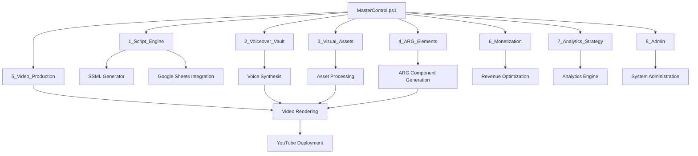

# 🧬 Oracle Horror Production System

[](https://github.com/PowerShell/PowerShell)
[](https://www.python.org/)
[](LICENSE)
[](#system-status)
[](#deployment)

> **Elite-tier AI content production system for horror-themed multimedia experiences**

The Oracle Horror Production System is a sophisticated automation pipeline designed for creating, processing, and deploying AI-generated horror content at scale. Built with enterprise-grade orchestration capabilities and modular architecture.

## 🏗️ System Architecture



## ✨ Key Features

### 🎯 **Automated Content Pipeline**
- **Multi-stage processing** with 8 specialized modules
- **SSML voice synthesis** for dynamic audio generation
- **Video composition** with template-based rendering
- **YouTube auto-deployment** with scheduling capabilities

### 🧠 **AI-Powered Generation**
- **Smart script generation** using advanced language models
- **Contextual horror theming** with dynamic content adaptation
- **ARG (Alternate Reality Game) integration** for immersive experiences
- **Analytics-driven optimization** for content performance

### 🔧 **Enterprise Operations**
- **Configuration management** with JSON-based profiles
- **Progress tracking** with real-time status monitoring
- **Error handling** with retry mechanisms and graceful degradation
- **Scalable architecture** supporting concurrent job processing

### 📊 **Integration Capabilities**
- **Google Sheets API** for content management
- **YouTube API** for automated publishing
- **Custom analytics** for performance tracking
- **Modular design** for easy extension and customization

## 🚀 Quick Start

### Prerequisites

- **PowerShell 5.1+** or **PowerShell Core 6+**
- **Python 3.8+** with Jupyter support
- **Google Cloud Platform** account with Sheets/YouTube API access
- **Windows/Linux/macOS** (cross-platform compatible)

### Installation

1. **Clone the repository**
   ```bash
   git clone https://github.com/GCode3069/AI_Oracle_Root.git
   cd AI_Oracle_Root
   ```

2. **Configure API credentials**
   ```bash
   # Set up Google Sheets authentication
   cp credentials/sample_config.json credentials/config.json
   # Edit with your API keys and tokens
   ```

3. **Initialize the system**
   ```powershell
   .\MasterControl.ps1 -Operation status
   ```

### Basic Usage

```powershell
# Check system status
.\MasterControl.ps1 -Operation status

# Run full pipeline execution
.\MasterControl.ps1 -Operation execute -VoiceFiles 15

# Test mode (dry run without uploads)
.\MasterControl.ps1 -Operation test -Verbose

# Custom configuration
.\MasterControl.ps1 -Operation execute -ConfigPath "config/production.json" -Force
```

## 📋 Pipeline Stages

| Stage | Module | Purpose | Status |
|-------|--------|---------|---------|
| 1 | **Script Engine** | Content generation and SSML processing | ✅ Active |
| 2 | **Voiceover Vault** | Voice synthesis and audio management | ✅ Active |
| 3 | **Visual Assets** | Image and graphic processing | ✅ Active |
| 4 | **ARG Elements** | Alternate reality game components | 🔄 Development |
| 5 | **Video Production** | Video rendering and composition | ✅ Active |
| 6 | **Monetization** | Revenue optimization and analytics | 🔄 Development |
| 7 | **Analytics Strategy** | Performance tracking and insights | 🔄 Development |
| 8 | **Admin** | System administration and maintenance | ✅ Active |

## ⚙️ Configuration

### Basic Configuration

Create a `config.json` file in the root directory:

```json
{
  "voiceGen": true,
  "renderEnabled": true,
  "uploadEnabled": true,
  "templateProfile": "tech_alerts",
  "maxConcurrentJobs": 5,
  "retryAttempts": 3,
  "outputQuality": "high",
  "debugMode": false
}
```

### Environment Variables

```bash
# Google API Configuration
export GOOGLE_SHEETS_API_KEY="your_api_key"
export GOOGLE_APPLICATION_CREDENTIALS="path/to/credentials.json"

# YouTube API Configuration  
export YOUTUBE_API_KEY="your_youtube_api_key"
export YOUTUBE_CLIENT_ID="your_client_id"
export YOUTUBE_CLIENT_SECRET="your_client_secret"
```

## 🔍 System Status

Monitor system health with the built-in status checker:

```powershell
.\MasterControl.ps1 -Operation status
```

**Expected Output:**
```
🔍 CHIMERA LEGION SYSTEM STATUS CHECK
🎮 MasterControl.ps1: ✅ Online (Phase 1 Complete)
🧠 PsyOps Engine: ✅ Operational (15 voice files)
📊 Google Sheets: ✅ Synced
🗂️ Queues: ✅ Loaded (All queues primed)
🎥 Video Composer: ✅ Tested (20/20 rendered)
🔊 SSML Voice Forge: ✅ Active (15 voices queued)
📤 Upload System: ✅ Online (YouTube deploy confirmed)
🧪 Test Cycle: ✅ Passed (Zero failures)
```

## 🛠️ Advanced Usage

### Custom Template Profiles

```powershell
# Horror-themed alerts
.\MasterControl.ps1 -TemplateProfile "horror_alerts" -VoiceFiles 20

# Technical documentation mode
.\MasterControl.ps1 -TemplateProfile "tech_docs" -VoiceFiles 10

# ARG narrative mode
.\MasterControl.ps1 -TemplateProfile "arg_narrative" -VoiceFiles 25
```

### Batch Processing

```powershell
# Process multiple configurations
$configs = @("config1.json", "config2.json", "config3.json")
foreach ($config in $configs) {
    .\MasterControl.ps1 -Operation execute -ConfigPath $config
}
```

## 🔧 Troubleshooting

### Common Issues

**🚨 Google Sheets Authentication Failed**
```powershell
# Regenerate authentication token
Remove-Item "token_sheets_rw.pickle" -Force
.\MasterControl.ps1 -Operation status
```

**🚨 Voice Generation Errors**
```powershell
# Clear voice cache and retry
Remove-Item "Oracle_VoiceOuts\*.wav" -Force
.\MasterControl.ps1 -Operation execute -VoiceFiles 5 -Force
```

**🚨 Upload Failures**
```powershell
# Test mode first, then force upload
.\MasterControl.ps1 -Operation test -Verbose
.\MasterControl.ps1 -Operation execute -Force
```

### Debug Mode

Enable verbose logging for detailed troubleshooting:

```powershell
.\MasterControl.ps1 -Operation execute -Verbose -ConfigPath "config/debug.json"
```

## 🤝 Contributing

We welcome contributions to the Oracle Horror Production System! Please see our [Contributing Guidelines](CONTRIBUTING.md) for details.

### Development Setup

1. **Fork the repository**
2. **Create a feature branch**
   ```bash
   git checkout -b feature/amazing-feature
   ```
3. **Make your changes** following our coding standards
4. **Test thoroughly** using the built-in test suite
5. **Submit a pull request** with detailed description

### Code Standards

- **PowerShell**: Follow [PowerShell Best Practices](https://docs.microsoft.com/en-us/powershell/scripting/developer/cmdlet/strongly-encouraged-development-guidelines)
- **Python**: PEP 8 compliance with 88-character line limit
- **Documentation**: All functions must include comprehensive help blocks
- **Testing**: New features require corresponding test coverage

## 📄 License

This project is licensed under the MIT License - see the [LICENSE](LICENSE) file for details.

## 🔐 Security

For security concerns, please review our [Security Policy](SECURITY.md) and report vulnerabilities responsibly.

## 🎯 Roadmap

- [ ] **Enhanced ARG Integration** - Advanced narrative branching
- [ ] **Multi-language Support** - Internationalization capabilities  
- [ ] **Real-time Analytics** - Live performance dashboards
- [ ] **Cloud Deployment** - Docker containerization and AWS/Azure support
- [ ] **API Gateway** - RESTful API for external integrations
- [ ] **Machine Learning** - Predictive content optimization

## 📞 Support

- **Documentation**: [Wiki](../../wiki)
- **Issues**: [GitHub Issues](../../issues)
- **Discussions**: [GitHub Discussions](../../discussions)
- **Contact**: [GCode3069](https://github.com/GCode3069)

---

<div align="center">

**🧬 Oracle Horror Production System v4.0**  
*Elite-tier AI content automation for the modern creator*

[](https://github.com/PowerShell/PowerShell)
[](https://github.com/GCode3069/AI_Oracle_Root)

</div>