# 🔄 Pipeline Flow Documentation

## Overview

The Oracle Horror Production System operates as an 8-stage pipeline that transforms raw content ideas into published video content. This document provides detailed flow diagrams and process documentation for the entire system.

## Complete System Flow

```mermaid
graph TB
    %% Input and Initialization
    A[Content Input] --> B[MasterControl.ps1]
    B --> C{System Status Check}
    C -->|✅ All Systems Operational| D[Pipeline Execution]
    C -->|❌ System Issues| E[Error Handling & Recovery]
    
    %% Main Pipeline Flow
    D --> F[Stage 1: Script Engine]
    F --> G[Stage 2: Voiceover Vault]
    G --> H[Stage 3: Visual Assets]
    H --> I[Stage 4: ARG Elements]
    I --> J[Stage 5: Video Production]
    J --> K[Stage 6: Monetization]
    K --> L[Stage 7: Analytics Strategy]
    L --> M[Stage 8: Admin]
    
    %% Output and Monitoring
    M --> N[YouTube Upload]
    N --> O[Performance Monitoring]
    O --> P[System Feedback Loop]
    P --> B
    
    %% Error Recovery
    E --> Q[Diagnostic Analysis]
    Q --> R[Component Repair]
    R --> C
    
    %% External Integrations
    S[Google Sheets API] --> F
    T[Azure Speech Services] --> G
    U[DALL-E / AI Image APIs] --> H
    V[Social Media APIs] --> I
    W[YouTube API] --> N
    X[Analytics APIs] --> L
```

## Stage-by-Stage Detailed Flow

### Stage 1: Script Engine Flow

### Stage 2: Voiceover Vault Flow

### Stage 3: Visual Assets Flow

### Stage 4: ARG Elements Flow

### Stage 5: Video Production Flow

### Stage 6: Monetization Flow

### Stage 7: Analytics Strategy Flow

### Stage 8: Admin Flow

## Cross-Stage Data Flow

### Content Lifecycle

### Error Handling Flow

## Performance Optimization Flow

### Resource Management

## Integration Points Map

## Timing and Synchronization

### Pipeline Timing Diagram

---

**Last Updated**: August 2024  
**Version**: 4.0  
**Maintainer**: [GCode3069](https://github.com/GCode3069)